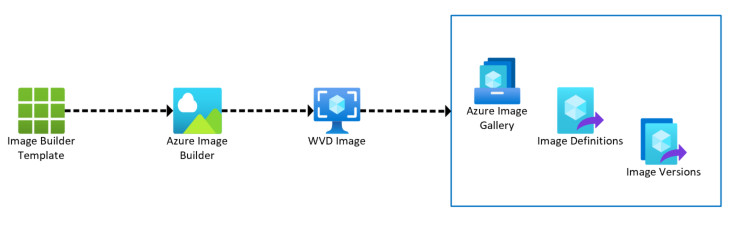

# Windows Virtual Desktop POC

The scripts and templates in this repo can be used to build a POC to demonstrate Windows Virtual Desktop.

Azure Firewall is used to provide routing between VNETs and managed access to the Internet

Windows Virtual Desktop Hosts can be isolated from one another to support certain customers security requirements.
This is done by placing each host on a seperate VNET and using Azure Firewall to control routing between VNETS

&nbsp;
&nbsp;
&nbsp;

# Image Builder

These templates provide an automated solution for building and updating Windows Virtual Desktop Hosts.

They use the Azure Image Builder Service to automate Image creation and support:
- Downloading and installing software from Azure Blob storage
- Downloading and installing Software directly from the internet
- Downloading and installing Choclatey packages
- Running Powershell configuration scripts
- Patching the Image with the latest Microsoft Updates
- Custom Reboots

More details can be found here: https://github.com/danielsollondon/azvmimagebuilder

&nbsp;
&nbsp;
&nbsp;

# Infrastructure

These templates will create:

* A storage account that will upload:
    * The  Powershell script used to configure the Image durinmg the Image capture process (AIBWin10MSImageBuild.ps1)
    * The binaries to install software from azure blob storage during the image capture process
    * The DSC scripts used to configure Windows during the Host build process
* A Key vault containing the following secrets
    * Local Admin user name and password for WVD Hosts
    * Domain Join user name and password used to join WVD Hosts to Active Directory
* An Azure Image Gallery
* A Managed Identity used by the Image Builder Service to access the Shared Image Gallery
* A role definition that grants access for the Managed Identity to the Shared Image Gallery
* An Azure Image Builder Template
* A template submission to create the Windows Virtual Desktop in the Azure Image Gallery
* Azure Virtual Networks for Windows Virtual Desktop Hosts
    * WVD hosts can be deployed into the same Azure VNET or isolated from one another by being deployed into seperate VNETS
* Azure Firewall rules to control the routing between VNETS
* VNet peerings between the HUB networkk (Where Azure Firewall is deployed) and spoke networks (where the WVD Hosts are running)
* NSGs and Route Tables for any VNETs that are deployed 
    * For Isolated VNETs, only rules allowing the Hosts to communicate with Active Directory and the Windows Virtual Desktop Management plane are deployed

&nbsp;
&nbsp;
&nbsp;

# How to use this Repo

&nbsp;
&nbsp;
&nbsp;

## To Deploy this solution:

* Correct the values in the deployment.Parameters.clean.json file
* Make sure you are in the 'ImageBuilder' Directory
* Run the ImageBuilder.ps1 script